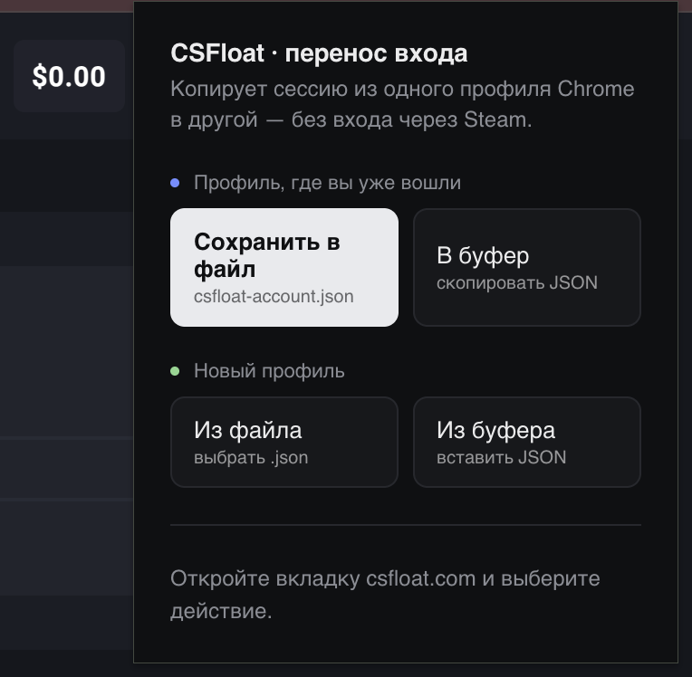

# CSFloat Account Transfer

Расширение для Chrome, которое переносит вход в CSFloat из одного профиля браузера в другой. Без повторного входа через Steam.

Работает только со своими аккаунтами. Переносите то, что вам принадлежит.

## Зачем

CSFloat держит авторизацию в двух местах: кука session (HttpOnly, обычным скриптом со страницы её не достать) и данные профиля в localStorage. Чтобы вход подхватился в другом профиле, нужны оба. Расширение забирает и то и другое одним действием и раскладывает обратно в новом профиле.

## Как работает

Экспорт собирает все куки домена csfloat.com (включая HttpOnly) через chrome.cookies API плюс весь localStorage открытой вкладки. Отдаёт это одним JSON: в файл или в буфер обмена.

Импорт берёт этот JSON, ставит куки с сохранением всех флагов (HttpOnly, Secure, SameSite, Domain, срок жизни) и записывает localStorage, потом обновляет страницу. После этого вкладка открыта под вашим аккаунтом.

## Установка в Chrome

Скачай архив csfloat-exporter.zip из раздела Releases и распакуй его. Потом:

1. Открой chrome://extensions
2. Включи Developer mode (переключатель справа сверху)
3. Нажми Load unpacked и укажи распакованную папку
4. Закрепи иконку на панели, если удобно

Если клонируешь репозиторий, указывай в Load unpacked саму папку репозитория, архив не нужен.

Ставить нужно в оба профиля: и в тот, откуда переносишь, и в тот, куда переносишь.

После правок в коде жми кнопку обновления на карточке расширения, чтобы подхватились изменения.

## Как пользоваться

В профиле, где ты уже вошёл:

1. Открой вкладку csfloat.com
2. Кликни по иконке расширения
3. Сохранить в файл или В буфер

В новом профиле:

1. Открой вкладку csfloat.com
2. Кликни по иконке
3. Из файла или Из буфера

Страница сама перезагрузится под перенесённым аккаунтом. Снизу в окне расширения пишется, сколько кук и записей localStorage перенеслось.

## Что держать в голове

Сессия временная. Когда токен протухнет, CSFloat снова попросит вход через Steam, и без доступа к самому Steam-аккаунту перелогиниться не выйдет. Для передачи насовсем нужен доступ к Steam.

Тот же компьютер это надёжно. На другой ПК или другой IP сессия может слететь, если сервер привязывает её к адресу.

Файл экспорта содержит живую сессию. Не коммить его и не выкладывай никуда. В .gitignore он уже исключён.

## Только csfloat

Домен зашит в двух местах: host_permissions в manifest.json и переменная DOMAIN в background.js. Для другого сайта поменяй их там.

## Лицензия

MIT
